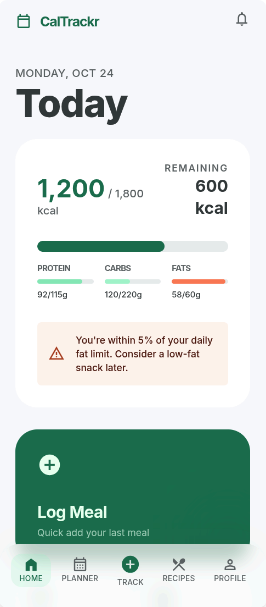
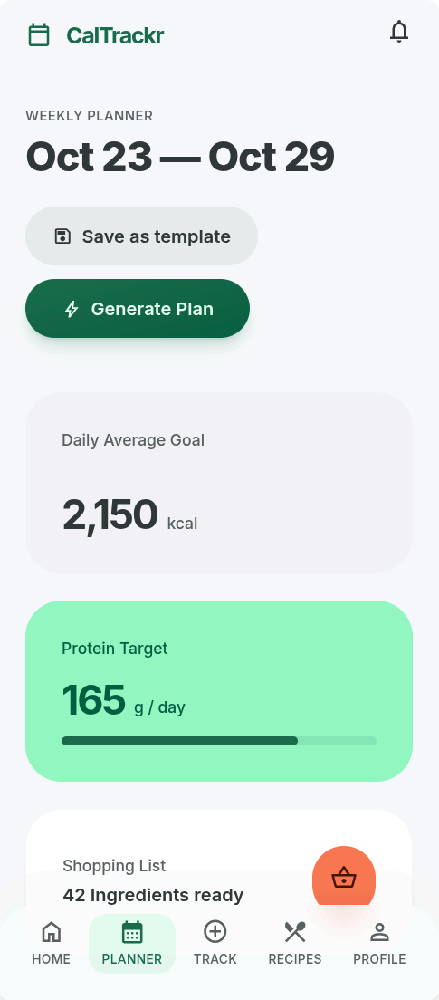
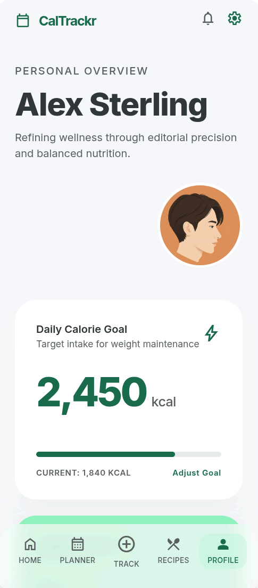
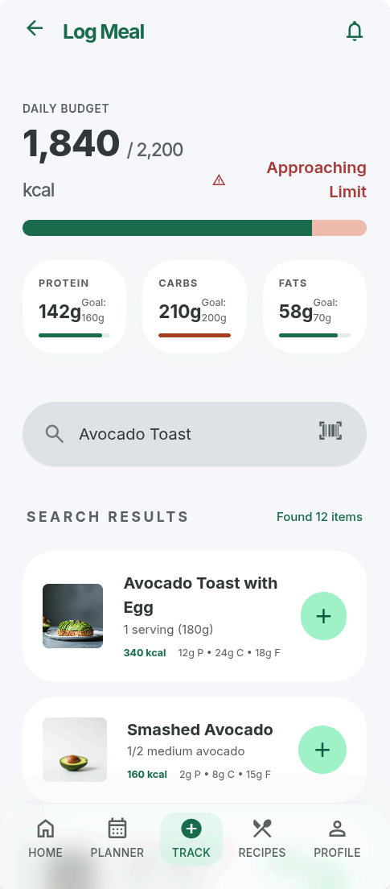
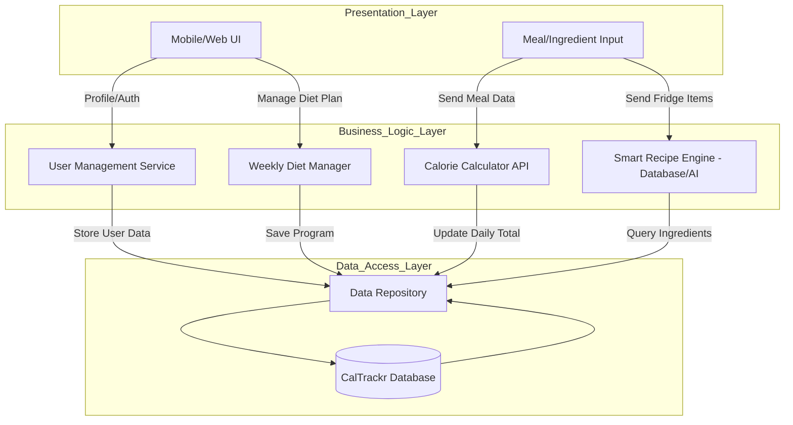
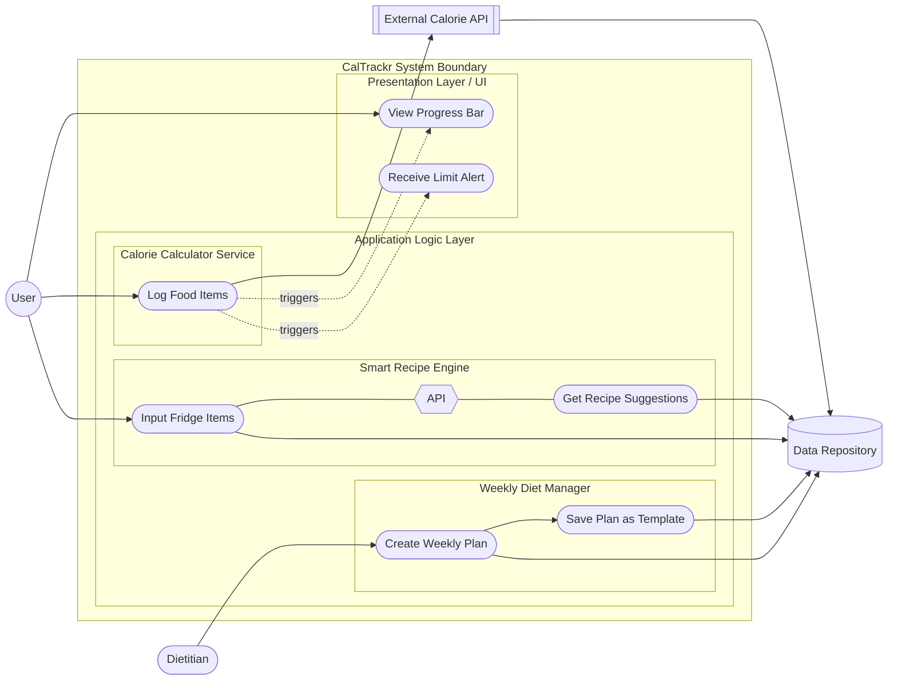
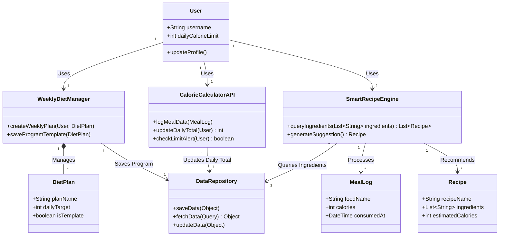
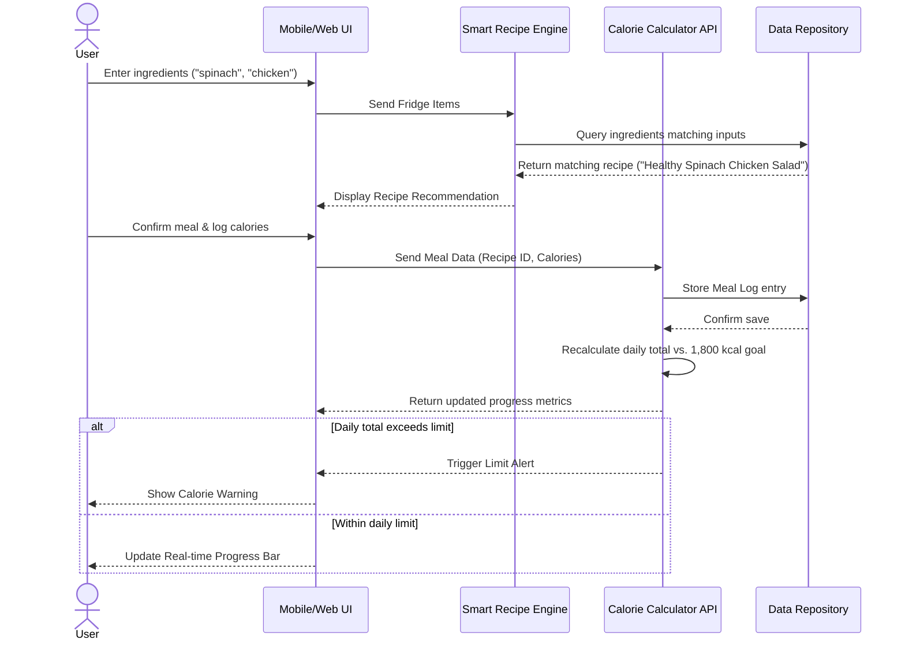

# 🥗 CalTrackr

**Smart meal planning and calorie tracking — powered by ingredient-aware recipe suggestions.**

*Plan your week. Track your meals. Cook what you already have.*

### [🌐 Click to see online demo.](https://stitch.withgoogle.com/preview/7275437999741914463?node-id=dce2f597f3354fb28f258dd3cbfd76e5)

## Preview

| Home | Planner |
|---|---|
|  |  |

| Profile | Tracking |
|---|---|
|  |  |

---

## Table of Contents

- [About](#about)
- [Features](#features)
- [How It Works](#how-it-works)
- [Architecture](#architecture)
- [Diagrams](#diagrams)
  - [System Architecture](#system-architecture)
  - [Use Case](#use-case)
  - [Class Diagram](#class-diagram)
  - [Sequence Diagram](#sequence-diagram)
- [Quality Attributes](#quality-attributes)
- [License](#license)

---

## About

CalTrackr is a mobile and web application built for people who want to eat better without the cognitive overhead of figuring out nutrition from scratch every day.

The core idea is simple: **your diet should adapt to your life, not the other way around.** CalTrackr gives you three tools to make that happen:

1. A weekly diet planner that generates a full nutritional schedule from your calorie goals.
2. A calorie tracker that monitors your intake in real time and alerts you before you go over.
3. A recipe engine that looks at what's already in your fridge and tells you what to cook.

Whether you're a busy professional trying to lose weight sustainably, or a home cook who wants to stop wasting ingredients, CalTrackr meets you where you are.

### [🌐 Click to see online demo.](https://stitch.withgoogle.com/preview/7275437999741914463?node-id=dce2f597f3354fb28f258dd3cbfd76e5)

---

## Features

### 🗓️ Weekly Diet Program
Generate a personalized 7-day meal plan based on your daily calorie target. Swap individual meals on the fly when your plans change, export the full week as a shopping list, and save plans that worked well as reusable templates for future weeks.

### 📊 Calorie Tracking
Log every meal with a quick search and see your daily intake reflected immediately in a real-time progress bar. CalTrackr compares each entry against your daily limit and fires an alert the moment you're close to exceeding it — so you can adjust proactively rather than reactively.

### 🔍 Smart Ingredient Recipes
Enter the ingredients you currently have — even just two or three — and CalTrackr surfaces recipes you can actually make right now. Filter results by prep time when you're in a hurry, and exclude allergens or ingredients you dislike so suggestions are always relevant and safe.

---

## How It Works

Here's a typical usage flow that shows how the three features connect:

> Sarah opens CalTrackr on Sunday evening and generates a 1,800-calorie-per-day plan for the week. By Tuesday she has leftover spinach and chicken in the fridge. Rather than sticking rigidly to the plan, she switches to the Smart Recipe Engine, enters her two ingredients, and finds a healthy spinach-chicken salad. She logs it directly in the app — her progress bar updates instantly, confirming she's still on track for her weight-loss goal.

This scenario reflects the app's design philosophy: **structure when you need it, flexibility when you don't.**

---

## Architecture

CalTrackr is built on a **Layered Architecture**, chosen for three reasons: it allows team members to work on the UI, business logic, and database in parallel without stepping on each other; it makes individual layers independently scalable; and it keeps the codebase approachable as the project grows.

The system is divided into three layers:

| Layer | Responsibility |
|---|---|
| **Presentation Layer** | Mobile/Web UI and all user input forms |
| **Business Logic Layer** | Three core services: Weekly Diet Manager, Calorie Calculator API, Smart Recipe Engine |
| **Data Access Layer** | A unified Data Repository abstracting all reads/writes to the CalTrackr database |

### Services

**Weekly Diet Manager**
Handles the creation, modification, and persistence of weekly diet plans. Users or dietitians can create a full 7-day plan targeted at a specific daily calorie goal. Plans can be saved as templates and reused, and individual meals can be swapped without rebuilding the whole schedule.

**Calorie Calculator API**
The backbone of daily tracking. Accepts meal log entries, queries an external nutrition API for calorie and macronutrient data, stores the results, and continuously recalculates the user's daily total. It exposes the current total to the UI for the progress bar and evaluates whether the daily limit has been breached to trigger alerts.

**Smart Recipe Engine**
Takes a list of ingredients as input and returns ranked recipe suggestions by querying the ingredient database. Supports filtering by prep time and exclusion of specific ingredients (e.g., allergens), making suggestions both practical and safe.

---

## Diagrams

### System Architecture

High-level view of all layers and how data flows between them.

---

### Use Case

Shows which actors interact with which system functions, and how the three services relate to the Presentation Layer and external dependencies.

---

### Class Diagram

Defines the core domain model: the entities involved, their attributes and methods, and the relationships between them.

---

### Sequence Diagram

Traces the full lifecycle of a single user action: finding a recipe from available ingredients, logging it, and receiving a calorie progress update.

---

## Quality Attributes

| Attribute | Design Decision |
|---|---|
| **Scalability** | Layered Architecture allows individual layers — particularly the Data Access Layer — to scale independently as the user base and nutritional dataset grow. |
| **Simplicity** | Clear separation of concerns across three layers keeps the codebase easy to reason about. Following the KISS principle avoids over-engineering and keeps onboarding fast for new contributors. |
| **Reliability** | External calorie API calls are handled with graceful error recovery. Diet programs and meal logs are persisted through a unified repository to ensure consistency and prevent data loss. |

---

## License

This project is licensed under the GNU General Public License v3.0 (GPLv3).

You are free to use, modify, and distribute this software under the terms of the GPLv3.  
Any derivative work must also be distributed under the same license.

See the full license text in the [LICENSE](LICENSE).

## Test conflict
## Oğuz Contribution
- Added project contribution section
- Changed this line by Oğuz
- hüseyinemre
